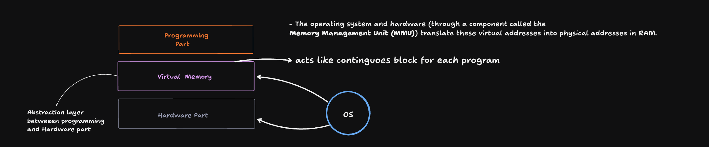

# Rektoff Lesson One: Rust Fundamentals & Memory Management

- **Core programming philosophy established**: Rust provides memory safety guarantees through compile-time analysis while maintaining low-level control comparable to C
    - Memory safety implemented via **ownership, borrowing, and lifetime systems** analyzed during MIR (Middle Intermediate Representation) phase
    - **Borrow checker** validates all ownership and borrowing rules before binary generation
    - Programs rejected if memory safety cannot be guaranteed, preventing undefined behavior at runtime
- **Memory layout architecture defined**: Process memory organized into distinct regions with specific allocation rules
    - **Stack memory**: Fixed-size data with LIFO (Last In, First Out) frame management for function scopes
    - **Heap memory**: Dynamic-size data requiring global allocator interaction with kernel for memory requests
    - **Static memory**: Program-lifetime data stored in data segment and BSS (Block Started by Symbol) sections

## 1. Virtual Memory and Addressing
On 64-bit systems, addresses are 64 bits wide, but only the lower 48 bits are used for actual memory mapping (256 TiB addressable space); the upper 16 bits must be all 0s or all 1s for canonical addresses.

Virtual addresses are the addresses your program uses—they are mapped to physical RAM addresses by the operating system and CPU’s Memory Management Unit (MMU).



When you print or manipulate pointer addresses in code (e.g., C, C++, Rust), you’re working with virtual addresses, not physical hardware addresses.

## 2. Stack vs. Heap
The stack stores function call frames and local variables; allocation and deallocation are fast and automatic.

The heap is for dynamic memory allocation (data whose size or lifetime isn’t known at compile time). Heap allocation is explicit in Rust (e.g., with Box, Vec, or String), and the stack stores only a pointer (and metadata) to the heap data.

Heap memory enables sharing and flexible lifetimes, but allocation is slower and must be managed carefully.

## 3. Heap Memory Management and System Calls
The heap is managed by a memory allocator, which requests large chunks of memory from the OS using system calls like brk, sbrk, or mmap (on Linux).

These system calls adjust the program break (end of the heap segment) or map new memory regions for use as heap.

The allocator splits and tracks these chunks for efficient reuse; freed memory may not be immediately returned to the OS.


## 4. ELF Binaries and Program Execution
Compiling Rust (or C/C++) code produces an ELF (Executable and Linkable Format) binary on Linux.

The ELF binary contains the machine code, metadata, and information for the OS loader to set up the process in memory.

When you run an ELF binary, the OS loader maps it into virtual memory, sets up stack and heap, resolves dependencies, and starts execution at the entry point (usually main).

## 5. Rust Memory Model and Ownership
Rust variables are stack-allocated by default; heap allocation requires explicit types.

Ownership and lifetimes are enforced by the Rust compiler, preventing memory leaks and use-after-free bugs.

When a heap-allocated value is moved (e.g., returned from a function), ownership is transferred, and the original variable is invalidated.

## 6. Pointer Arithmetic
Arithmetic on pointers (addresses) is just integer math on virtual addresses; the MMU translates these to physical addresses at access time.

Subtracting or adding to pointers is common for navigating arrays or data structures, but the addresses are always virtual within the process’s space.

## 7. Tools for Exploration
Tools like `readelf`, `objdump`, and `hexdump` let you inspect ELF binaries, view headers, sections, and raw machine code.

These tools help you understand how your source code is translated into executable machine instructions and how memory is organized.

## 8. Performance and Practical Limits
On systems with limited RAM (e.g., Mac M1 with 8 GB), opening many apps or browser tabs can exhaust memory, forcing the OS to use slower SSD swap, causing lag.

The 48-bit virtual address limit is a practical compromise between hardware complexity and the vast address space most applications need today.

## Compilation Process & Analysis

- **Multi-stage compilation pipeline**: Source code transforms through multiple representations with safety analysis at each stage
    - **Abstract Syntax Tree → Higher Intermediate Representation → MIR → Binary** compilation flow
    - **Type inference and trait resolution** performed during higher representation phase
    - **Memory safety analysis** conducted exclusively during MIR phase before code generation
- **Macro expansion system**: Compile-time code generation distinct from runtime function calls
    - **Macro rules** expand to additional Rust source code before compilation begins
    - **Format macros** handled as **compiler built-ins** for architecture-specific implementations
    - **Cargo expand** tool available for investigating macro expansions

## Memory Allocation Strategies

- **Stack allocation rules**: Automatic memory management with scope-based deallocation
    - All local variables allocated to **stack frames** with deterministic sizes
    - **Frame popping** occurs when functions complete, automatically deallocating local data
    - **Return value slots** reserved at frame creation even for unit-returning functions
- **Heap allocation requirements**: Dynamic data requires explicit allocation requests
    - **Box** and **Vec** types utilize **global allocator trait** for kernel memory requests
    - **Unique pointers** guaranteed non-null with exclusive access to prevent data races
    - **Capacity vs length tracking** enables efficient vector growth without constant reallocation

## Static vs Constant Data Management

- **Constant evaluation**: Compile-time computation with inline replacement
    - **Constants** evaluated during **rustc_const_eval** phase using **MIR interpreter**
    - **Syntactic replacement** occurs throughout program, inlining computed values
    - **Mirror interpreter** provides separate execution environment for constant evaluation
- **Static memory allocation**: Program-lifetime data with memory addresses
    - **String literals** stored in **read-only data section** accessible program-wide
    - **Mutable statics** allocated to **writable data section** for runtime modification
    - **Zero-initialized arrays** stored in **BSS section** to minimize binary size

## Binary Analysis & Debugging Tools

- **Binary inspection capabilities**: Multiple tools available for examining compiled output
    - **readelf** command provides section analysis including **size, type, and flags**
    - **objdump -s -j** enables raw binary section content examination
    - **cargo expand** reveals macro expansions for understanding code generation
- **Development environment setup**: IDE debugging features for memory visualization
    - **Rust Rover IDE** provides **memory view debugging** with heap allocation tracking
    - **Stack frame visualization** available through debugger stepping functionality
    - **Global allocator** operations observable during debugging sessions

## Virtual Memory & Process Management

- **Virtual memory abstraction**: Operating system provides process-isolated memory spaces
    - **Memory Management Unit (MMU)** handles **virtual-to-physical address translation**
    - **Process pages** appear as **contiguous memory blocks** despite physical fragmentation
    - **Virtual addresses** exceed physical memory capacity through **page table management**


## Some Commands: 
```
objdump -s -j __const target_binary    # for read-only data
objdump -s -j __data target_binary     # for initialized data  
objdump -s -j __bss target_binary      # for uninitialized data
```

## In summary:
You now understand how modern operating systems and CPUs manage memory using virtual addresses, how stack and heap work, how system calls like brk/sbrk/mmap expand the heap, how Rust and ELF binaries fit into this model, and how tools can help you explore these concepts in practice.


## Some Resources:
[Computerphile video on Virtual Memory](https://youtu.be/5lFnKYCZT5o?si=RsmHGUWzVL4EPewp) <br/>
[Nice Animated video to visualize the Virtual Memory](https://youtu.be/ultz9m0n0GE?si=XgdYxsPZpXkc1PCh)<br/>
[Very Nice Conversation in Stack Overflow](https://stackoverflow.com/questions/22290347/understanding-virtual-address-virtual-memory-and-paging)
